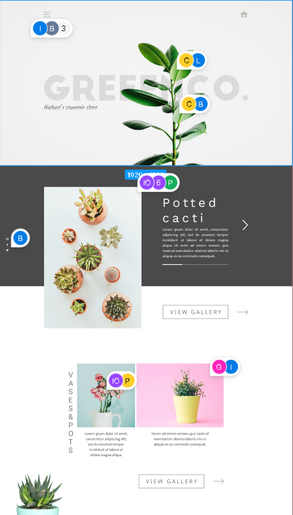
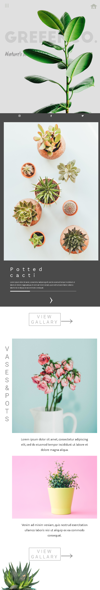

<h1>Вёрстка страницы с сайта figma.com</h1>

Вёрстка выполнена с помощью:

<ul>
<li>html</li>
<li>css</li>
<li>scss</li>
<ul>

Ссылка на оригинал:

https://www.figma.com/file/PA7CqhfYElaTSDc0HNwmGusd/Greenco_Free_by_Schooljerkdesigns?type=design&node-id=0-2&mode=design&t=0GltK8B7TxFlC1KP-0

 

Оригинал:

Результат под компьютеры

Результат под мобильные устройства

